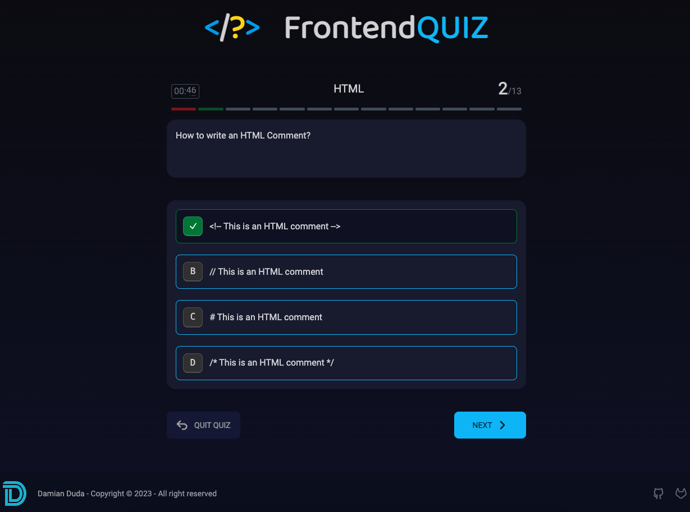

# </?> FrontendQUIZ


## Getting Started

Install packages:

```bash
yarn install
```

Run local development:

```bash
yarn dev
```

Build the app:

```bash
yarn build
```

## Link
[FrontendQUIZ](https://frontquiz.vercel.app/)

## Preview
[](/public/preview.png)

## Tools
- Contentful: https://app.contentful.com/
- XLSX to JSON: https://xlsx-to-json-quiz.stackblitz.io

## TODO
- [x] migrate to latest nextjs
- [x] add favicon
- [ ] migrate to latest contentful (https://github.com/contentful/contentful.js/issues/1932)
- [ ] add responsive mode (mobile)
- [ ] add css animation for questions
- [ ] accessibility
