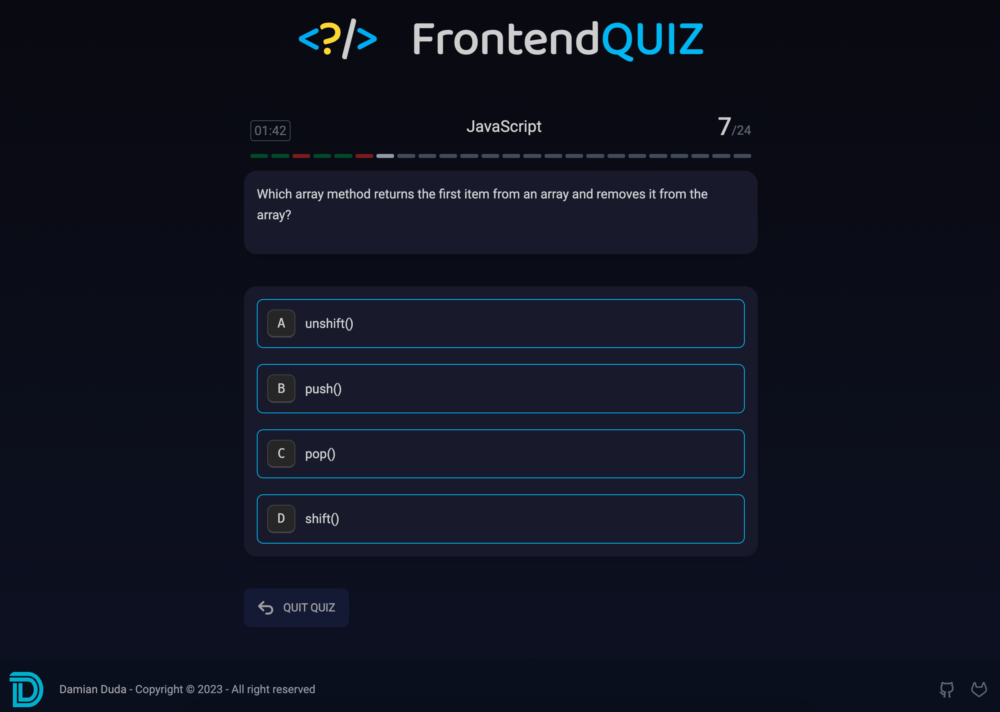

# </?> FrontendQUIZ

## Getting Started

Install packages:

```bash
yarn install
```

Run local development:

```bash
yarn dev
```

Build the app:

```bash
yarn build
```

## Link
[FrontendQUIZ](https://balmor.github.io/frontendQuiz/)

## Preview
[](/public/preview.png)

## TODO
- [ ] migrate to latest nextjs
- [ ] add css animation for questions
- [ ] add responsive mode (mobile)
- [ ] accessibility
